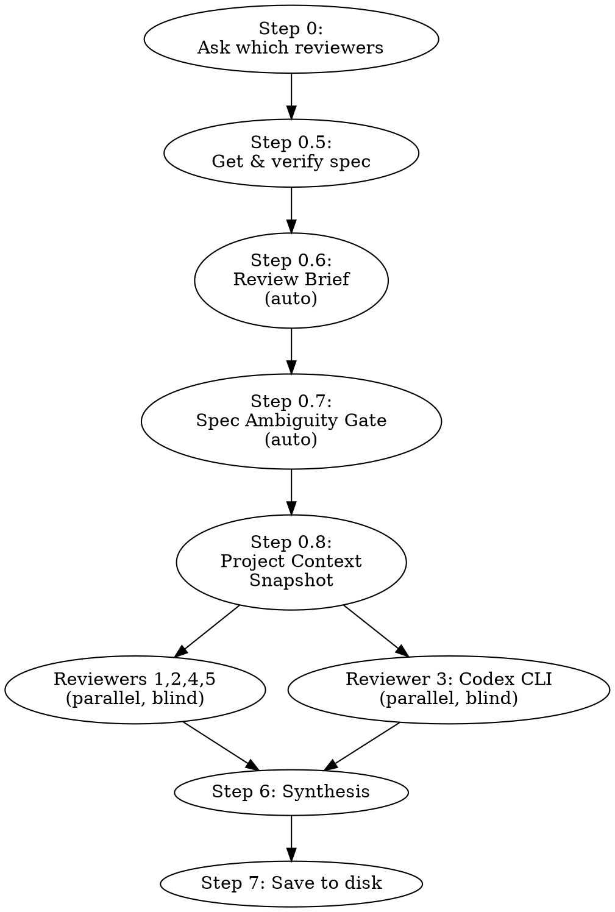

# Multi-Layer Technical Review

## Overview

Run a spec or ТЗ through up to five **independent blind reviewers** in parallel. Each reviewer has a distinct role, works independently (no shared findings), and grounds analysis in actual project files. Together they cover what one reviewer misses — and independent convergence on the same issue is a strong signal.

**The session that produced this skill:** User asked to review a PDF→MD converter spec. Without the skill, Claude used only an internal Plan agent. After adding Codex CLI, 9 new issues were found. Four-layer review is the correct default.

---

## Step 0 — Always Ask First

**MANDATORY:** Before running any reviewer, ask the user which ones to use via `AskUserQuestion` with `multiSelect: true`.

```
AskUserQuestion(questions=[{
    "question": "Каких рецензентов запустить?",
    "header": "Рецензенты",
    "multiSelect": true,
    "options": [
        {"label": "Requirements Traceability (цель)", "description": "Правильную задачу решаем? Спек → бизнес-цель, метрики успеха, альтернативы"},
        {"label": "Plan Agent (архитектура)", "description": "Структура, полнота, API design, граничные случаи"},
        {"label": "Codex CLI (код)", "description": "Риски реализации, противоречия, небезопасные паттерны. Требует установленного Codex CLI"},
        {"label": "Devil's Advocate (пользователь)", "description": "'А что если...' от лица конечного пользователя"},
        {"label": "Robustness Checklist (системный)", "description": "Error handling, concurrency, cleanup, security, testability"}
    ]
}])
```

- If none selected → run all five.
- If user says "skip" explicitly → skip all reviewers, but warn once: "Ревью пропущено по запросу пользователя."
- "None selected in multiselect" ≠ "skip" — the former means run all, the latter means run none.

---

## Step 0.5 — Получить и проверить спек

**MANDATORY перед запуском ревьюеров.**

1. Определить источник спека:
   - Файл приложен к сообщению → прочитать через Read tool
   - Путь к файлу указан → прочитать через Read tool
   - Текст вставлен напрямую → использовать как есть
   - Ничего не приложено → спросить: "Пришли спек — файл или текст"

2. Проверить на PII/секреты:
   - Если в спеке видны пароли, токены, персональные данные →
     предупредить: "Спек содержит [тип данных]. Продолжить?" и ждать подтверждения.

3. Сохранить спек как переменную SPEC_CONTENT для подстановки в промпты.
   Во всех reviewer prompts заменять `[SPEC CONTENT]` на реальное содержимое спека.

4. Если спек > 10 000 символов — предупредить пользователя о возможно долгом ревью.

---

## Step 0.6 — Review Brief (автоматический)

**Формируется автоматически** после получения спека. Цель — дать ревьюерам полную картину, а не голый текст.

**Что собрать:**

1. **Что за проект** — название, стек, стадия (из структуры проекта, манифестов)
2. **Что за документ** — определить тип (спек, ТЗ, план, RFC, дизайн-док) по содержимому и заголовкам. Указать заголовок и размер
3. **Стадия по теме спека** — `Grep` по ключевым сущностям спека (модули, классы, API endpoints). Есть ли уже код по этой теме, или это с нуля?
4. **Связанные файлы** — какие файлы в проекте уже относятся к теме спека (результат Grep из п.3)

**Формат:** свободный текст, 3-5 предложений. Как если бы ты объяснял коллеге контекст перед ревью.

**Пример:**
```
REVIEW_BRIEF:
Проект TGmanager — Python CLI для работы с Telegram через Telethon. Проект в продакшне,
основной код в tg.py. Спек описывает новый модуль рассылки (broadcast). Кода рассылки
пока нет — это новый функционал. Связанные файлы: tg.py (точка входа, 200 строк),
config.py (конфиг сессии Telethon).
```

**Этот блок подставляется в `[REVIEW BRIEF]`** в каждом промпте ревьюера вместе с `[PROJECT CONTEXT]` и `[SPEC CONTENT]`.

---

## Step 0.7 — Spec Ambiguity Gate (автоматический)

**Запускается всегда** после получения спека, перед ревьюерами.

Проверить спек на:
- Неопределённые термины ("быстро", "много", "удобно" без критериев)
- Противоречия между секциями
- Отсутствующие ограничения (лимиты, тайм-ауты, объёмы данных)
- Неоднозначные требования (одну фразу можно понять двумя способами)

**Если проблем нет** — продолжить без сообщений.

**Если найдены проблемы** — показать список и спросить:
> "Спек содержит [N] неоднозначностей: [список]. Уточнить перед ревью или продолжить как есть?"

- Если уточняет → обновить SPEC_CONTENT и продолжить
- Если "продолжить" → добавить в начало каждого reviewer prompt:
  ```
  Note: spec has known ambiguities: [список]. Flag assumptions you make about them.
  ```

---

## Step 0.8 — Project Context Snapshot (одноразовый)

**Запускается один раз** после Ambiguity Gate, перед ревьюерами. Цель — собрать контекст проекта, чтобы ревьюеры работали с реальными данными, а не рассуждали в вакууме.

**Сбор контекста:**

1. **Структура проекта** — `Glob("**/*", depth=2)` для верхнеуровневой карты
2. **Манифесты** — `Read` package.json / pyproject.toml / Cargo.toml / go.mod (что есть)
3. **Entry points** — `Read` main/index файлы, точки входа
4. **Релевантный код** — `Grep` по ключевым сущностям из спека (имена модулей, API endpoints, классы). Читать найденные файлы через `Read`
5. **Конфиги** — `.env.example`, docker-compose, CI configs (если упомянуты в спеке)

**Результат:** компактный блок `PROJECT_CONTEXT` (до ~2000 символов):

```
PROJECT_CONTEXT:
- Structure: [top-level dirs and key files]
- Stack: [language, framework, dependencies relevant to spec]
- Existing code: [summaries of files related to spec topics]
- Patterns: [architecture patterns found — e.g. "MVC", "event-driven", "monorepo"]
```

**Если проект пустой** (спек до начала разработки) — собрать только то что есть (может быть только README или ничего). Указать: "Project is empty — no existing code to reference."

**Этот блок подставляется в `[PROJECT CONTEXT]`** в каждом промпте ревьюера.

---

## Steps 1–5 — Run Selected Reviewers

**BLIND REVIEW: каждый ревьюер работает независимо.** Никакой передачи findings между ревьюерами. Каждый видит только спек + контекст проекта. Это устраняет confirmation bias и эскалацию паники.

**Параллельный запуск:** Reviewers 1, 2, 4, 5 (Agent-based) можно запускать параллельно. Reviewer 3 (Codex CLI) запускается отдельно через Bash. Запускай максимум ревьюеров параллельно для скорости.

**Tell the user which reviewer is running** before each Agent call, e.g. "Запускаю Reviewer 2 — Plan Agent (архитектура)...". Long sequential runs feel like a hang without progress feedback.



---

### Common prompt block (подставляется в каждый промпт ревьюера)

```
Context:
[REVIEW BRIEF]

Project context:
[PROJECT CONTEXT]

You have access to Read, Glob, and Grep tools. If the spec references existing
modules, APIs, or files — look them up in the project to verify claims.
Do NOT just reason abstractly — ground your review in actual project state.

OUTPUT FORMAT — for each finding, output EXACTLY:
- **[Critical/Important/Minor]** Section: "<spec section name>" — <finding in 1-2 sentences>

OUTPUT RULES:
- Maximum 10 findings, sorted by severity (Critical first)
- Every finding MUST reference a specific section of the spec
- Do NOT invent problems that don't exist in the spec
- Do NOT give generic advice ("add logging", "consider edge cases", "add tests")
- Only flag concrete, specific problems you can point to in the spec text
- If you find no issues in your area — say "No issues found" (this is a valid outcome)

Spec:
[SPEC CONTENT]
```

---

### Reviewer 1 — Requirements Traceability

**Role:** Проверяет что спек решает правильную задачу, а не просто правильно написан.

**Call via:**
```
Agent(subagent_type="general-purpose", prompt="""
You are a requirements analyst. Your job is NOT to find bugs in the design —
it's to verify the design solves the actual problem.

[COMMON PROMPT BLOCK]

Additionally, for this spec answer:
1. What is the stated business/user goal? Is it explicitly defined?
2. Does the proposed solution actually achieve that goal? Or does it solve a related but different problem?
3. What does success look like? Are there measurable criteria?
4. What simpler solution was NOT considered? Why is this complexity justified?
5. Who is the user? Is the spec written for the right audience?

Be direct and proportional. Report facts, not fears.
""")
```

**What it finds:** Solution solving wrong problem, missing success criteria, unjustified complexity, undefined target user.

**Когда использовать:** всегда — особенно когда ты сам формулируешь задачу на ходу, или когда не уверен что правильно понял что нужно сделать.

---

### Reviewer 2 — Plan Agent (Architectural)

**Role:** Structure, completeness, API design, trade-offs, edge cases.

**Call via:**
```
Agent(subagent_type="Plan", prompt="""
You are a technical architect.

[COMMON PROMPT BLOCK]

MANDATORY: Before reviewing, examine the project structure and existing code.
Check how existing modules are organized, what patterns are used, what dependencies
are already in place.

Review the spec for:
- Structural gaps and missing components
- API/interface design quality
- Trade-offs not considered
- Edge cases not covered
- Contradictions between sections
- Compatibility with existing project architecture (check actual files!)

Be proportional — distinguish real architectural problems from stylistic preferences.
""")
```

**What it finds:** Missing abstractions, wrong layering, unclear contracts.

---

### Reviewer 3 — Codex CLI

**Role:** Code-level critique — what breaks in real implementation.

**Call via (safe — cross-platform, UTF-8-safe, auto-cleanup on crash):**
```bash
# Cross-platform temp file (works on Windows/Mac/Linux)
SPEC_TMPFILE="$(python3 -c "import tempfile; f=tempfile.NamedTemporaryFile(delete=False,suffix='.txt',prefix='spec-review-'); print(f.name); f.close()")"
trap "rm -f \"$SPEC_TMPFILE\"" EXIT

cat > "$SPEC_TMPFILE" << 'SPECEOF'
[paste spec content here]
SPECEOF

# UTF-8-safe size check and truncation (characters, not bytes)
SPEC_CHARS=$(python3 -c "print(len(open('$SPEC_TMPFILE',encoding='utf-8').read()))")
if [ "$SPEC_CHARS" -gt 4000 ]; then
    echo "⚠️ Спек $SPEC_CHARS символов — усечён до 4000 для Codex (без разрыва символов)"
fi
SPEC_FOR_CODEX=$(python3 -c "print(open('$SPEC_TMPFILE',encoding='utf-8').read()[:4000])")

codex exec --skip-git-repo-check "$SPEC_FOR_CODEX

Ты технический рецензент. Найди: риски реализации, противоречия, небезопасные паттерны. Будь краток."
```

⚠️ Do NOT use `echo "$SPEC_CONTENT" > file` — apostrophes (e.g. "Devil's") and backticks in the spec will break single-quoted strings or be evaluated by the shell.

Why Python for temp/truncation: `python3` is available everywhere this skill runs (Windows/Mac/Linux), avoids `/tmp` path issues on Windows, and truncates at character boundaries instead of bytes — which prevents Cyrillic characters from being sliced mid-byte.

Use default model (no `--model` flag — avoids incompatibility with ChatGPT accounts).

**What it finds:** Implementation risks, dependency contradictions, unsafe patterns, missing error handling.

---

### Reviewer 4 — Devil's Advocate Agent

**Role:** End-user perspective. Tries to break it.

**Call via:**
```
Agent(subagent_type="general-purpose", prompt="""
You are a skeptical end user and QA engineer.

[COMMON PROMPT BLOCK]

Before reviewing: check the project for existing UX patterns, error messages,
user-facing flows. If there's existing UI code or CLI — read it to understand
the current user experience.

For each section of the spec, ask:
1. What happens when this fails?
2. What did the user NOT ask for but will expect?
3. What edge case will hit on day 1?

Be adversarial but proportional. Flag real user-facing problems.
Do NOT inflate hypothetical edge cases into critical issues — mark unlikely
scenarios as Minor unless they cause data loss or security problems.
""")
```

**What it finds:** Missing UX flows, wrong defaults, surprise behaviors, missing "happy to sad path" transitions.

---

### Reviewer 5 — Robustness Checklist

**Role:** Systematic scan against known failure modes.

**Call via:**
```
Agent(subagent_type="general-purpose", prompt="""
You are a reliability engineer.

[COMMON PROMPT BLOCK]

Before scoring: check the project for existing error handling patterns,
test infrastructure, logging setup, security measures. Score based on what
the spec ADDS or CHANGES relative to what already exists in the project.

Score each area 0-3. Flag areas scoring 0 or 1 as required fixes.

Areas: Error handling / Concurrency / Resource cleanup / Data integrity /
Performance / Security / Observability / Testability

For each area: score (0-3) + 1-line explanation of what's missing or present.
Base scores on evidence from the spec and project, not worst-case imagination.
A score of 0-1 means you found a concrete gap, not a theoretical one.

Additionally, output findings in the standard format (see OUTPUT FORMAT above).
""")
```

Reference table for what each area checks:

| Area | Check |
|------|-------|
| **Error handling** | All external calls wrapped? Errors surface cleanly? |
| **Concurrency** | Thread safety? Race conditions? GUI/worker separation? |
| **Resource cleanup** | Temp files deleted? Connections closed? `finally` blocks? |
| **Data integrity** | Atomic writes? Partial failure leaves consistent state? |
| **Performance** | Blocking calls identified? Memory bounds for large inputs? |
| **Security** | User input sanitized? No path traversal? No shell injection? |
| **Observability** | Logging? Progress feedback? Error messages actionable? |
| **Testability** | Logic separated from I/O? Pure functions identifiable? |

---

### Independence Rule (BLIND REVIEW)

**DO NOT pass findings from one reviewer to another.** Each reviewer works
independently with only the spec + project context. This is by design:

- Eliminates confirmation bias and panic escalation
- Independent findings that converge = strong signal
- Independent findings that conflict = valuable for user to decide
- Deduplication happens in Synthesis (Step 6), not during review

---

## Step 6 — Synthesis

1. Собрать все findings от запущенных ревьюеров в один список.

2. **Дедупликация и валидация силой независимости:**
   Ревьюеры работали слепо — совпадения значат больше, чем раньше.
   - Если 2+ ревьюера **независимо** нашли одно и то же — это сильный сигнал.
     Пометить "(independently confirmed by N reviewers)" и повысить severity на один уровень
     (Minor→Important, Important→Critical). Но не выше Critical.
   - Если только 1 ревьюер нашёл — оставить его severity как есть.
   - **Не завышать severity при синтезе.** Задача синтеза — агрегировать, а не нагнетать.

3. **Разрешение противоречий:** если два ревьюера противоречат друг другу —
   отметить как "CONFLICT: [позиция A] vs [позиция B]" и вынести на решение пользователя.
   Не выбирать победителя самостоятельно.

4. **Категоризировать по критериям:**
   - **Critical**: ломает функциональность / данные / безопасность. Нельзя мержить.
   - **Important**: деградирует качество, есть workaround. Исправить до релиза.
   - **Minor**: улучшение UX, стиль, nice-to-have. Можно отложить.

5. Для каждого finding указать traceability:
   - Из какой секции спека (например: "Section 3 — API Design")
   - Какой ревьюер нашёл

6. Показать синтез пользователю.

7. **НЕ перезаписывать оригинальный спек.**
   Вместо этого: предложить список изменений и спросить:
   "Применить Critical + Important исправления к спеку? (y/n)"
   Если да — создать новую версию: `<original-name>-revised.md`

8. **Definition of Done:** ревью считается завершённым когда:
   - Все Critical issues либо исправлены либо явно приняты пользователем
   - Synthesis показан пользователю
   - Файл сохранён (Step 6)

Скажи пользователю: не начинай разработку пока Critical issues не решены.

---

## Step 7 — Save to Disk (MANDATORY)

After presenting the synthesis, ALWAYS save results to disk. Do not skip this step.

### Path derivation (dynamic — never hardcode)

1. Determine base home directory:
   - Windows: `echo $USERPROFILE`
   - Unix/Mac: `echo $HOME`
   - Result path: `<HOME>/.claude/projects/<project-slug>/memory/reviews/`

2. Determine active project slug:
   - Derive from current working directory: convert path to slug (replace `/`, `\`, `:`, spaces with `-`, lowercase)
     - Example: `E:\VibeCoding\MyProject` → `e--VibeCoding-MyProject`
   - If unsure which project — ask the user: "Сохранить в memory какого проекта?"
   - Default fallback: derive slug from `$PWD` automatically

3. Create the folder if it doesn't exist:
   ```bash
   mkdir -p "<reviews-folder>"
   ```
   **Verify the mkdir succeeded before writing.** If it fails — report the error, do not proceed silently.

### Slug rule for filename

- If spec has a filename → strip extension, lowercase, replace spaces/special chars with `-`, truncate to 40 chars
- If spec is inline text → take the first H1 heading (`# Title`), or the first non-empty line
- Strip Windows-illegal chars: `/ \ : * ? " < > |`
- Example: `"Auth Module ТЗ v2.pdf"` → `auth-module-v2`

Final filename: `YYYY-MM-DD-<slug>.md`

If a file with the same name already exists — append `-2`, `-3`, etc. Never silently overwrite.

### File format

```markdown
# Review: <spec name>
Date: YYYY-MM-DD
Skill version: 3.0
Reviewers run: [список запущенных]
Reviewers skipped: [список с причинами, или "none"]
Spec source: <filename or "inline text">

## Robustness Scores
| Area | Score |
|------|-------|
| Error handling | N/3 |
| Concurrency | N/3 |
| Resource cleanup | N/3 |
| Data integrity | N/3 |
| Performance | N/3 |
| Security | N/3 |
| Observability | N/3 |
| Testability | N/3 |

## Critical
- [finding] *(Section: X, Reviewer: Y)*

## Important
- [finding] *(Section: X, Reviewer: Y)*

## Minor
N issues. [one-sentence summary]

## Conflicts (требуют решения пользователя)
- [conflict description]

## Verdict
[Ready / Not ready / With fixes — one sentence]
```

Keep the file under 80 lines. This is a reference summary, not a transcript.

### Verification

After writing, confirm the file exists:
```bash
ls "<full-file-path>"
```
If the file is missing — report the error explicitly: "Не удалось сохранить ревью: [причина]". Never silently continue.

### Tell the user

After successful save, say:
> Ревью сохранено: `<full-path>`

---

## Finding Past Reviews

When the user asks about a previous review of a spec:

```bash
# Check folder exists before listing
if [ -d "<reviews-folder>" ]; then
    ls "<reviews-folder>"
else
    echo "No reviews found yet for this project."
fi
```

1. Match by spec name or date
2. Read the matching file and summarize findings
3. If multiple files match — list them and ask which one

---

## When to Skip a Reviewer

| Situation | Skip |
|-----------|------|
| Codex not installed / auth error | Reviewer 3 — note the skip in output |
| Codex not in git repo | Try `--skip-git-repo-check` first, then skip if still fails |
| Spec is purely UX/design, no code | Reviewer 3 |
| Spec is a quick 1-page outline | Reviewers 3+4 can be combined into one agent call |
| User explicitly says "skip review" | All reviewers — but warn once |

---

## Common Mistakes

- **Using only the Plan agent** — misses code-level and user-perspective issues
- **Skipping Codex because it feels redundant** — it finds different things (dependency conflicts, unsafe string ops, missing exception types)
- **Not synthesizing** — presenting four separate reviews without reconciling them confuses the user
- **Passing findings between reviewers** — causes confirmation bias and panic escalation. Reviewers MUST work blind
- **Not deduplicating findings** — the list looks bigger but has less value
- **Overwriting original spec** — always create `-revised.md` instead
- **Reviewers reasoning without reading files** — every reviewer should use Read/Glob/Grep to ground analysis in actual project state
- **Inflating severity** — hypothetical edge cases are Minor unless they cause data loss or security issues. Be proportional
