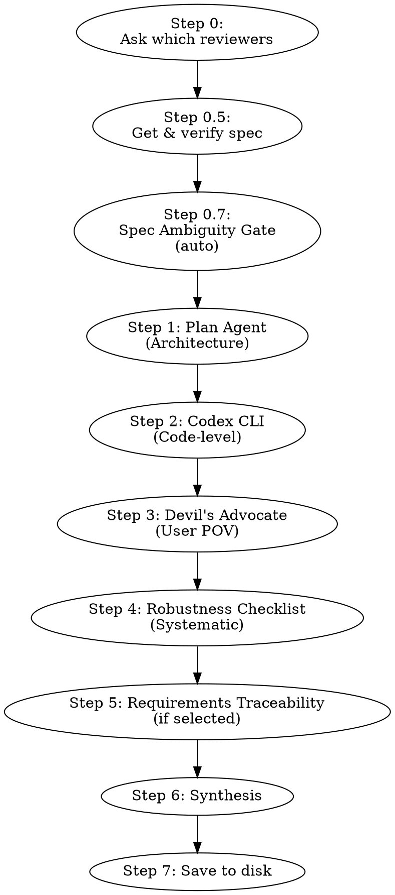

# Multi-Layer Technical Review

## Overview

Run a spec or ТЗ through up to five independent reviewers in sequence. Each reviewer has a distinct role and blind spots — together they cover what one reviewer misses.

**The session that produced this skill:** User asked to review a PDF→MD converter spec. Without the skill, Claude used only an internal Plan agent. After adding Codex CLI, 9 new issues were found. Four-layer review is the correct default.

---

## Step 0 — Always Ask First

**MANDATORY:** Before running any reviewer, ask the user which ones to use via `AskUserQuestion` with `multiSelect: true`.

```
AskUserQuestion(questions=[{
    "question": "Каких рецензентов запустить?",
    "header": "Рецензенты",
    "multiSelect": true,
    "options": [
        {"label": "Plan Agent (архитектура)", "description": "Структура, полнота, API design, граничные случаи"},
        {"label": "Codex CLI (код)", "description": "Риски реализации, противоречия, небезопасные паттерны"},
        {"label": "Devil's Advocate (пользователь)", "description": "'А что если...' от лица конечного пользователя"},
        {"label": "Robustness Checklist (системный)", "description": "Error handling, concurrency, cleanup, security, testability"},
        {"label": "Requirements Traceability (цель)", "description": "Правильную задачу решаем? Спек → бизнес-цель, метрики успеха, альтернативы"}
    ]
}])
```

- If none selected → run all five.
- If user says "skip" explicitly → skip all reviewers, but warn once: "Ревью пропущено по запросу пользователя."
- "None selected in multiselect" ≠ "skip" — the former means run all, the latter means run none.

---

## Step 0.5 — Получить и проверить спек

**MANDATORY перед запуском ревьюеров.**

1. Определить источник спека:
   - Файл приложен к сообщению → прочитать через Read tool
   - Путь к файлу указан → прочитать через Read tool
   - Текст вставлен напрямую → использовать как есть
   - Ничего не приложено → спросить: "Пришли спек — файл или текст"

2. Проверить на PII/секреты:
   - Если в спеке видны пароли, токены, персональные данные →
     предупредить: "Спек содержит [тип данных]. Продолжить?" и ждать подтверждения.

3. Сохранить спек как переменную SPEC_CONTENT для подстановки в промпты.
   Во всех reviewer prompts заменять `[SPEC CONTENT]` на реальное содержимое спека.

4. Если спек > 10 000 символов — предупредить пользователя о возможно долгом ревью.

---

## Step 0.7 — Spec Ambiguity Gate (автоматический)

**Запускается всегда** после получения спека, перед ревьюерами.

Проверить спек на:
- Неопределённые термины ("быстро", "много", "удобно" без критериев)
- Противоречия между секциями
- Отсутствующие ограничения (лимиты, тайм-ауты, объёмы данных)
- Неоднозначные требования (одну фразу можно понять двумя способами)

**Если проблем нет** — продолжить без сообщений.

**Если найдены проблемы** — показать список и спросить:
> "Спек содержит [N] неоднозначностей: [список]. Уточнить перед ревью или продолжить как есть?"

- Если уточняет → обновить SPEC_CONTENT и продолжить
- Если "продолжить" → добавить в начало каждого reviewer prompt:
  ```
  Note: spec has known ambiguities: [список]. Flag assumptions you make about them.
  ```

---

## Steps 1–5 — Run Selected Reviewers

Run selected reviewers in order. From Reviewer 2 onwards, each receives prior findings with instruction to **confirm, refute, or add new** — not just repeat.



---

### Reviewer 1 — Plan Agent (Architectural)

**Role:** Structure, completeness, API design, trade-offs, edge cases.

**Call via:**
```
Agent(subagent_type="Plan", prompt="""
You are a technical architect. Review the following spec for:
- Structural gaps and missing components
- API/interface design quality
- Trade-offs not considered
- Edge cases not covered
- Contradictions between sections

[SPEC CONTENT]
""")
```

**What it finds:** Missing abstractions, wrong layering, unclear contracts.

---

### Reviewer 2 — Codex CLI

**Role:** Code-level critique — what breaks in real implementation.

**Call via (safe — use heredoc to avoid quoting issues with apostrophes and special chars):**
```bash
cat > /tmp/spec-for-codex.txt << 'SPECEOF'
[paste spec content here]
SPECEOF

codex exec --skip-git-repo-check "$(head -c 8000 /tmp/spec-for-codex.txt)

Ты технический рецензент. Найди: риски реализации, противоречия, небезопасные паттерны. Будь краток."
rm /tmp/spec-for-codex.txt
```

⚠️ Do NOT use `echo "$SPEC_CONTENT" > file` — apostrophes (e.g. "Devil's") and backticks in the spec will break single-quoted strings or be evaluated by the shell.

Use default model (no `--model` flag — avoids incompatibility with ChatGPT accounts).

**What it finds:** Implementation risks, dependency contradictions, unsafe patterns, missing error handling.

---

### Reviewer 3 — Devil's Advocate Agent

**Role:** End-user perspective. Tries to break it.

**Call via:**
```
Agent(subagent_type="general-purpose", prompt="""
You are a skeptical end user and QA engineer. Your job is to find problems.
Ask "what if..." questions. Find UX failures. Find runtime surprises.
Be adversarial. Don't accept assumptions.

For each section of this spec, ask:
1. What happens when this fails?
2. What did the user NOT ask for but will expect?
3. What edge case will hit on day 1?

[SPEC CONTENT]
""")
```

**What it finds:** Missing UX flows, wrong defaults, surprise behaviors, missing "happy to sad path" transitions.

---

### Reviewer 4 — Robustness Checklist

**Role:** Systematic scan against known failure modes.

**Call via:**
```
Agent(subagent_type="general-purpose", prompt="""
You are a reliability engineer. Score each area 0-3 for the following spec.
Flag areas scoring 0 or 1 as required fixes.

Areas: Error handling / Concurrency / Resource cleanup / Data integrity /
Performance / Security / Observability / Testability

For each area: score (0-3) + 1-line explanation of what's missing or present.

[SPEC CONTENT]
""")
```

Reference table for what each area checks:

| Area | Check |
|------|-------|
| **Error handling** | All external calls wrapped? Errors surface cleanly? |
| **Concurrency** | Thread safety? Race conditions? GUI/worker separation? |
| **Resource cleanup** | Temp files deleted? Connections closed? `finally` blocks? |
| **Data integrity** | Atomic writes? Partial failure leaves consistent state? |
| **Performance** | Blocking calls identified? Memory bounds for large inputs? |
| **Security** | User input sanitized? No path traversal? No shell injection? |
| **Observability** | Logging? Progress feedback? Error messages actionable? |
| **Testability** | Logic separated from I/O? Pure functions identifiable? |

---

### Reviewer 5 — Requirements Traceability *(если выбран)*

**Role:** Проверяет что спек решает правильную задачу, а не просто правильно написан.

**Call via:**
```
Agent(subagent_type="general-purpose", prompt="""
You are a requirements analyst. Your job is NOT to find bugs in the design —
it's to verify the design solves the actual problem.

For this spec, answer:
1. What is the stated business/user goal? Is it explicitly defined?
2. Does the proposed solution actually achieve that goal? Or does it solve a related but different problem?
3. What does success look like? Are there measurable criteria?
4. What simpler solution was NOT considered? Why is this complexity justified?
5. Who is the user? Is the spec written for the right audience?

Be direct. If the spec doesn't answer these questions, say so.

[SPEC CONTENT]
""")
```

**What it finds:** Solution solving wrong problem, missing success criteria, unjustified complexity, undefined target user.

**Когда использовать:** когда ты сам формулируешь задачу на ходу, или когда не уверен что правильно понял что нужно сделать.

---

### Passing context between reviewers

From Reviewer 2 onwards, append to the prompt:
```
Prior findings from previous reviewers:
[findings list]

Your job: confirm or refute each finding, AND find issues not yet covered.
Do NOT just repeat — add your independent judgment.
```

If Reviewer N was skipped, instead append:
```
Note: Reviewer [N] was skipped. No prior findings from that reviewer.
Base your review on the spec directly.
```

---

## Step 6 — Synthesis

1. Собрать все findings от запущенных ревьюеров в один список.

2. **Дедупликация:** если 2+ ревьюера нашли одно и то же — оставить одну запись,
   пометить "(confirmed by N reviewers)".

3. **Разрешение противоречий:** если два ревьюера противоречат друг другу —
   отметить как "CONFLICT: [позиция A] vs [позиция B]" и вынести на решение пользователя.
   Не выбирать победителя самостоятельно.

4. **Категоризировать по критериям:**
   - **Critical**: ломает функциональность / данные / безопасность. Нельзя мержить.
   - **Important**: деградирует качество, есть workaround. Исправить до релиза.
   - **Minor**: улучшение UX, стиль, nice-to-have. Можно отложить.

5. Для каждого finding указать traceability:
   - Из какой секции спека (например: "Section 3 — API Design")
   - Какой ревьюер нашёл

6. Показать синтез пользователю.

7. **НЕ перезаписывать оригинальный спек.**
   Вместо этого: предложить список изменений и спросить:
   "Применить Critical + Important исправления к спеку? (y/n)"
   Если да — создать новую версию: `<original-name>-revised.md`

8. **Definition of Done:** ревью считается завершённым когда:
   - Все Critical issues либо исправлены либо явно приняты пользователем
   - Synthesis показан пользователю
   - Файл сохранён (Step 6)

Скажи пользователю: не начинай разработку пока Critical issues не решены.

---

## Step 7 — Save to Disk (MANDATORY)

After presenting the synthesis, ALWAYS save results to disk. Do not skip this step.

### Path derivation (dynamic — never hardcode)

1. Determine base home directory:
   - Windows: `echo $USERPROFILE`
   - Unix/Mac: `echo $HOME`
   - Result path: `<HOME>/.claude/projects/<project-slug>/memory/reviews/`

2. Determine active project slug:
   - Check if current working directory maps to a known project (e.g. `e--VibeCoding`, `e--VibeCoding-TGmanager`)
   - If unsure which project — ask the user: "Сохранить в memory какого проекта?"
   - Default fallback slug: `e--VibeCoding`

3. Create the folder if it doesn't exist:
   ```bash
   mkdir -p "<reviews-folder>"
   ```
   **Verify the mkdir succeeded before writing.** If it fails — report the error, do not proceed silently.

### Slug rule for filename

- If spec has a filename → strip extension, lowercase, replace spaces/special chars with `-`, truncate to 40 chars
- If spec is inline text → take the first H1 heading (`# Title`), or the first non-empty line
- Strip Windows-illegal chars: `/ \ : * ? " < > |`
- Example: `"Auth Module ТЗ v2.pdf"` → `auth-module-v2`

Final filename: `YYYY-MM-DD-<slug>.md`

If a file with the same name already exists — append `-2`, `-3`, etc. Never silently overwrite.

### File format

```markdown
# Review: <spec name>
Date: YYYY-MM-DD
Skill version: 2.0
Reviewers run: [список запущенных]
Reviewers skipped: [список с причинами, или "none"]
Spec source: <filename or "inline text">

## Robustness Scores
| Area | Score |
|------|-------|
| Error handling | N/3 |
| Concurrency | N/3 |
| Resource cleanup | N/3 |
| Data integrity | N/3 |
| Performance | N/3 |
| Security | N/3 |
| Observability | N/3 |
| Testability | N/3 |

## Critical
- [finding] *(Section: X, Reviewer: Y)*

## Important
- [finding] *(Section: X, Reviewer: Y)*

## Minor
N issues. [one-sentence summary]

## Conflicts (требуют решения пользователя)
- [conflict description]

## Verdict
[Ready / Not ready / With fixes — one sentence]
```

Keep the file under 80 lines. This is a reference summary, not a transcript.

### Verification

After writing, confirm the file exists:
```bash
ls "<full-file-path>"
```
If the file is missing — report the error explicitly: "Не удалось сохранить ревью: [причина]". Never silently continue.

### Tell the user

After successful save, say:
> Ревью сохранено: `<full-path>`

---

## Finding Past Reviews

When the user asks about a previous review of a spec:

```bash
# Check folder exists before listing
if [ -d "<reviews-folder>" ]; then
    ls "<reviews-folder>"
else
    echo "No reviews found yet for this project."
fi
```

1. Match by spec name or date
2. Read the matching file and summarize findings
3. If multiple files match — list them and ask which one

---

## When to Skip a Reviewer

| Situation | Skip |
|-----------|------|
| Codex not installed / auth error | Reviewer 2 — note the skip in output |
| Codex not in git repo | Try `--skip-git-repo-check` first, then skip if still fails |
| Spec is purely UX/design, no code | Reviewer 2 |
| Spec is a quick 1-page outline | Reviewers 3+4 can be combined into one agent call |
| User explicitly says "skip review" | All reviewers — but warn once |

---

## Common Mistakes

- **Using only the Plan agent** — misses code-level and user-perspective issues
- **Skipping Codex because it feels redundant** — it finds different things (dependency conflicts, unsafe string ops, missing exception types)
- **Not synthesizing** — presenting four separate reviews without reconciling them confuses the user
- **Running reviewers in parallel** — Reviewer 3 and 4 should see Reviewer 1+2 output to avoid duplication
- **Not deduplicating findings** — the list looks bigger but has less value
- **Overwriting original spec** — always create `-revised.md` instead
